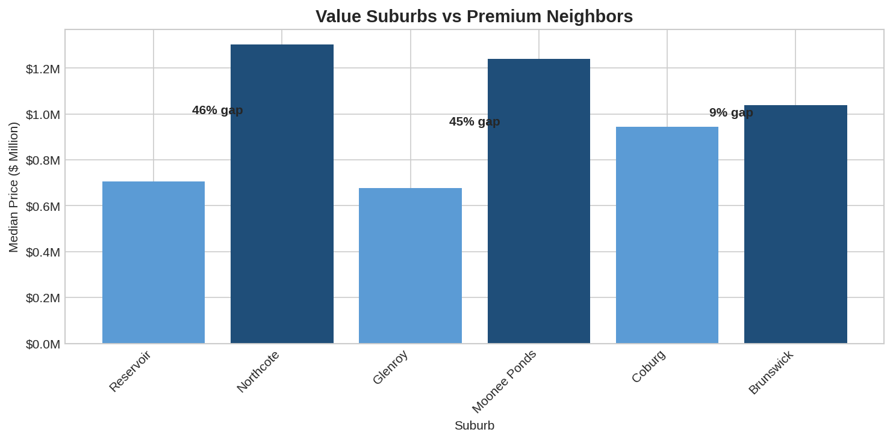
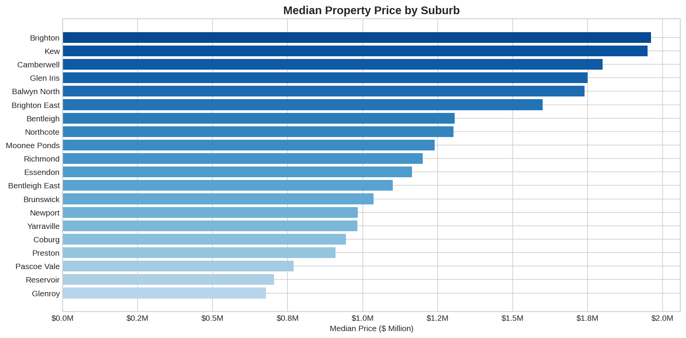
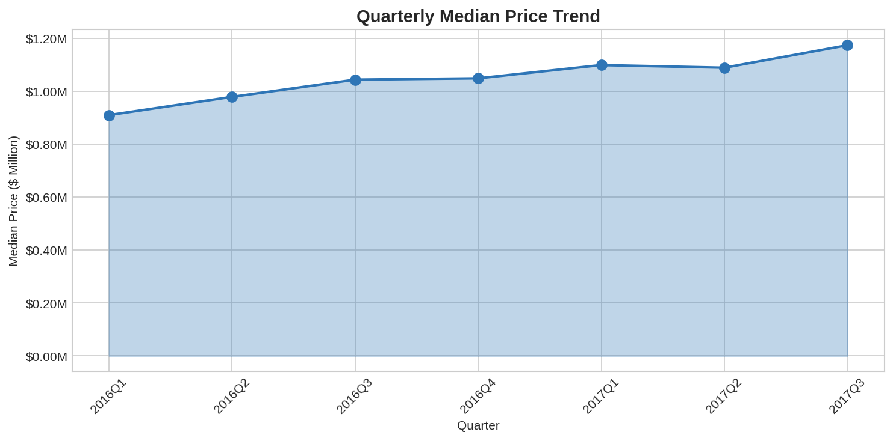
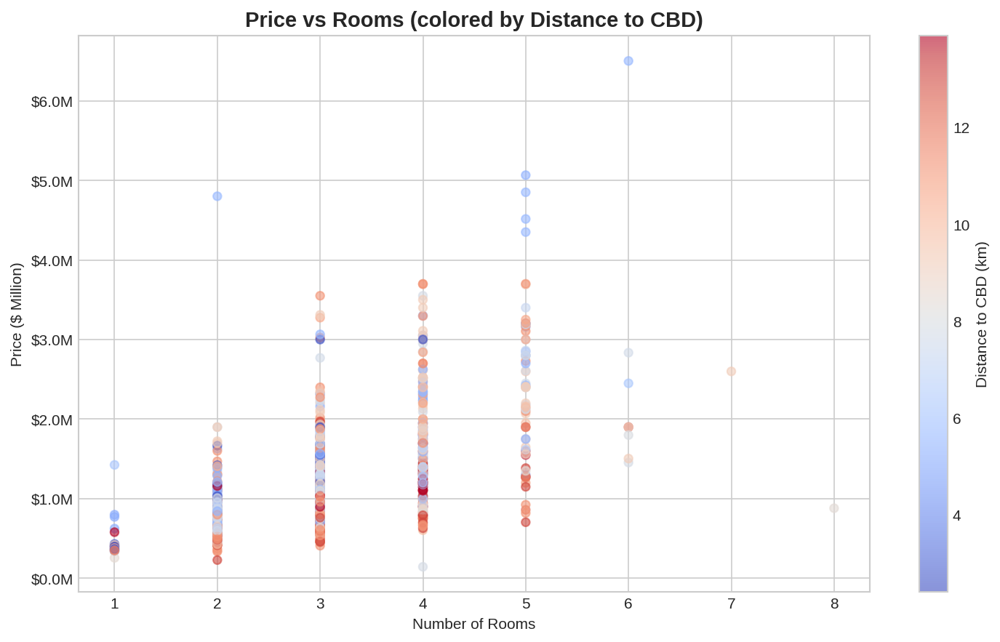

# Melbourne Housing Market Analysis

Analysis of 13,580 property transactions across Melbourne's top 20 suburbs by volume, identifying investment opportunities through price comparisons, property type premiums, and market trends.

**Data Source:** [Kaggle Melbourne Housing Dataset](https://www.kaggle.com/datasets/dansbecker/melbourne-housing-snapshot) (Domain.com.au, 2016-2017)

## Key Metrics

| Metric | Value |
|--------|-------|
| Raw Records | 13,580 |
| Cleaned Records | 11,638 |
| Analysis Subset | 3,419 (20 suburbs) |
| Data Completeness | 95.2% |
| Market Growth | +20% (Q2 2016 to Q3 2017) |

## Investment Insights

### 1. Undervalued Northern Suburbs

Reservoir and Glenroy trade at 45-46% discount to adjacent premium suburbs despite similar amenities and strong transaction volume.

| Value Suburb | Median Price | Premium Neighbor | Discount |
|--------------|-------------|------------------|----------|
| Reservoir | $705,000 | Northcote ($1.3M) | 46% |
| Glenroy | $678,000 | Moonee Ponds ($1.24M) | 45% |
| Coburg | $944,000 | Brunswick ($1.04M) | 9% |



### 2. House vs Unit Premiums

Houses command significant premiums in established suburbs, suggesting unit buyers face less competition.

- Kew: 230% house premium over units
- Camberwell: 204% premium
- Glen Iris: 172% premium

### 3. Bedroom Premium

4-bedroom houses command 30-46% premium over 3-bedroom in eastern suburbs.

- Kew: 46% premium ($1.6M to $2.35M)
- Brighton: 40% premium
- Camberwell: 37% premium

## Dashboard







## Project Structure

```
Melbourne-Housing-Analysis/
├── data/
│   ├── raw/
│   │   └── melb_data.csv              # Original dataset (13,580 records)
│   └── processed/
│       ├── melb_data_cleaned.csv      # Cleaned dataset (11,638 records)
│       └── melb_data_analysis.csv     # Analysis subset (3,419 top 20 suburbs)
├── src/
│   ├── data_cleaning.py               # Data cleaning pipeline
│   ├── feature_engineering.py         # Feature creation
│   └── generate_insights.py           # Analysis and insights
├── images/                            # Visualizations
│   ├── median_price_by_suburb.png
│   ├── price_vs_rooms.png
│   ├── property_type_distribution.png
│   ├── quarterly_trends.png
│   └── value_suburbs.png
├── docs/
│   ├── README.md                      # Project documentation
│   ├── Analysis_Summary.docx          # Investment insights report
│   └── requirements.txt               # Python dependencies
└── README.md                          # This file
```

## Methodology

### Data Cleaning

1. Removed 1,942 records with invalid Landsize (<=0 or >50,000 sqm)
2. Standardized 314 suburb names (8 case corrections)
3. Filled missing Car values with 0
4. Final completeness: 95.2%

### Suburb Selection

Selected top 20 suburbs by transaction volume (minimum 121 transactions each) to ensure statistical significance. This subset represents 29.4% of the cleaned dataset.

### Outlier Detection

Flagged properties with price deviation >50% from suburb median as potential investment opportunities. Identified 567 underpriced and 300 overpriced properties.

## Tools

- **Python:** pandas, numpy, matplotlib
- **Excel:** Pivot tables, charts, conditional formatting
- **Data Source:** Kaggle Melbourne Housing Dataset

## Limitations

- Historical data (2016-2017), not current market conditions
- Excludes off-market sales and private transactions
- BuildingArea missing for 47.5% of records
- Analysis limited to top 20 suburbs by volume

## Usage

```bash
# Install dependencies
pip install pandas numpy matplotlib openpyxl

# Run cleaning pipeline
python src/data_cleaning.py

# Generate features
python src/feature_engineering.py

# Generate insights
python src/generate_insights.py
```

## License

Data sourced from Kaggle under CC0 Public Domain. Analysis code available for educational purposes.
