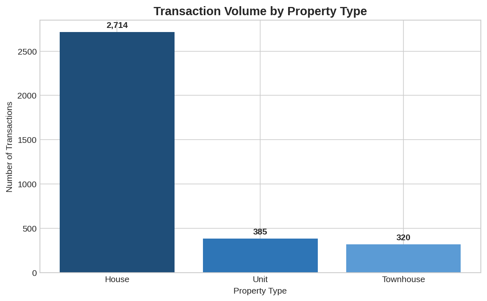

# Melbourne Housing Investment Dashboard

Data-driven investment analysis tool identifying undervalued suburbs and market opportunities across Melbourne's housing market. Built with Python and Excel.

## Key Findings

**Undervalued Opportunities**
- Reservoir and Glenroy trade at 45-46% discount to adjacent premium suburbs (Northcote, Moonee Ponds)
- Houses command 100-230% premiums over units in eastern suburbs

**Market Trends**
- 20% market growth from Q2 2016 to Q3 2017
- Strongest gains in Q4 2016

## Visualisations





## Deliverables

**Excel Dashboard** (`Melbourne_Housing_Dashboard.xlsx`)
- Interactive suburb lookup with dynamic VLOOKUP
- Executive KPIs and investment recommendations
- Quarterly trend analysis with automated calculations
- Property type premium analysis by suburb

**Python Pipeline**
- Automated data cleaning (13,580 → 11,638 records)
- Feature engineering and validation
- Excel dashboard generation

## Technical Stack

**Excel**: Pivot tables, VLOOKUP/XLOOKUP, INDEX/MATCH, conditional formatting, SUMIFS/COUNTIFS, statistical functions

**Python**: pandas, data validation, ETL pipeline, automated reporting

## Project Structure

```
├── data/
│   ├── raw/melb_data.csv
│   └── processed/
│       ├── melb_data_cleaned.csv (11,638 records)
│       └── melb_data_analysis.csv (3,419 records)
├── src/
│   ├── data_cleaning.py
│   ├── feature_engineering.py
│   ├── generate_insights.py
│   └── create_dashboard.py
├── docs/
│   └── Melbourne_Housing_Dashboard.xlsx
└── images/
```

## Quick Start

```bash
pip install pandas numpy matplotlib openpyxl
python src/data_cleaning.py
python src/feature_engineering.py
python src/create_dashboard.py
```

## Data Quality

- **Raw**: 13,580 transactions
- **Cleaned**: 11,638 records (removed invalid land sizes, standardised suburbs)
- **Analysis**: 3,419 records (top 20 suburbs by volume)
- **Completeness**: 95.2%
- **Period**: Q2 2016 - Q3 2017

**Note**: Historical data (2016-2017). BuildingArea missing for 47.5% of records.

## Data Source

[Kaggle Melbourne Housing Dataset](https://www.kaggle.com/datasets/dansbecker/melbourne-housing-snapshot) (Domain.com.au)
