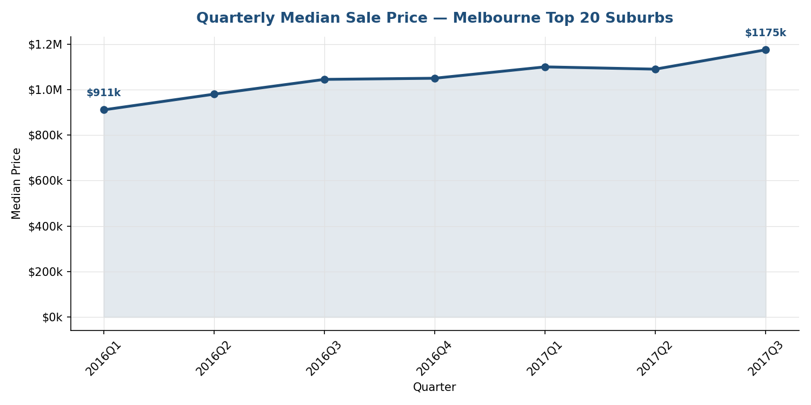
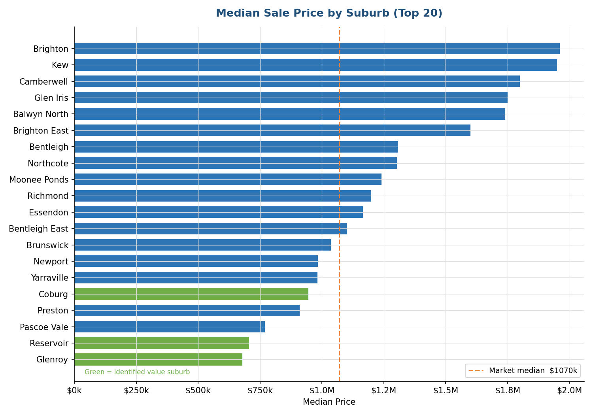
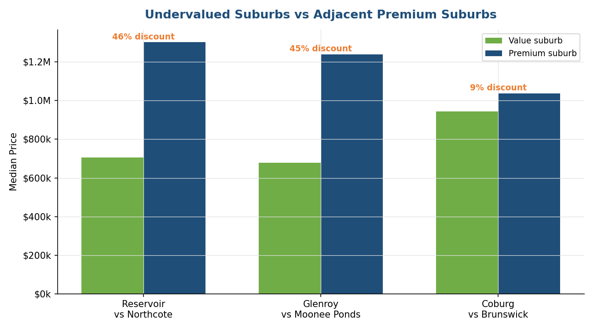
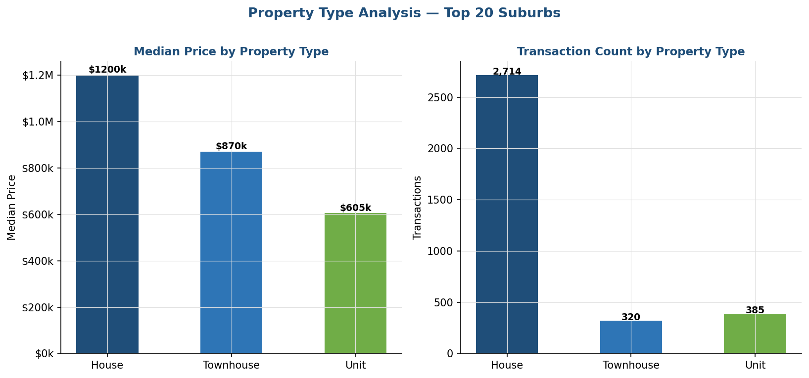
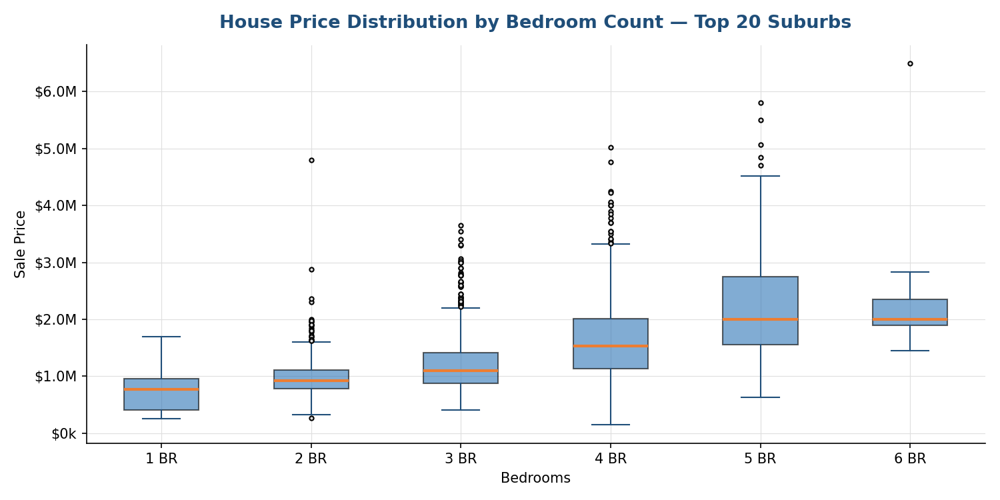

# Melbourne Housing Investment Dashboard

Data-driven investment analysis tool identifying undervalued suburbs and market opportunities across Melbourne's housing market. Built with Python, Excel, and Power BI.

## Key Findings

**Undervalued Opportunities**
- Reservoir and Glenroy trade at 45-46% discount to adjacent premium suburbs (Northcote, Moonee Ponds)
- Houses command 100-230% premiums over units in eastern suburbs

**Market Trends**
- 20% market growth from Q2 2016 to Q3 2017
- Strongest gains in Q4 2016

## Visualisations











## Deliverables

**Excel Dashboard** (`Melbourne_Housing_Dashboard.xlsx`)
- Interactive suburb lookup with dynamic VLOOKUP
- Executive KPIs and investment recommendations
- Quarterly trend analysis with automated calculations
- Property type premium analysis by suburb

**Power BI Export** (`data/powerbi/`)
- Star-schema data model: 1 fact table, 3 dimension tables, 4 pre-aggregated summary tables
- Copy-paste DAX measures for median price, QoQ growth, market growth %, and value suburb KPIs
- Import all CSVs into Power BI Desktop and apply relationships via `dim_suburb`, `dim_date`, `dim_property_type`

**Python Pipeline**
- Automated data cleaning (13,580 → 11,638 records)
- Feature engineering and validation
- Chart generation (matplotlib)
- Excel dashboard generation
- Power BI star-schema export

## Technical Stack

**Excel**: Pivot-style analysis tables, VLOOKUP/XLOOKUP, INDEX/MATCH, conditional formatting, SUMIFS/COUNTIFS, statistical functions

**Power BI**: Star-schema data model, DAX measures (median price, QoQ growth, market growth %)

**Python**: pandas, matplotlib, openpyxl -ETL pipeline, visualisation, automated reporting

## Project Structure

```
├── data/
│   ├── raw/melb_data.csv
│   ├── processed/
│   │   ├── melb_data_cleaned.csv (11,638 records)
│   │   └── melb_data_analysis.csv (3,419 records)
│   └── powerbi/
│       ├── fact_transactions.csv
│       ├── dim_suburb.csv
│       ├── dim_date.csv
│       ├── dim_property_type.csv
│       ├── agg_quarterly_trends.csv
│       ├── agg_suburb_summary.csv
│       ├── agg_property_type_premium.csv
│       ├── agg_value_gaps.csv
│       └── powerbi_measures.dax
├── src/
│   ├── data_cleaning.py
│   ├── feature_engineering.py
│   ├── generate_insights.py
│   ├── generate_visualisations.py
│   ├── create_dashboard.py
│   └── create_powerbi_export.py
├── docs/
│   └── Melbourne_Housing_Dashboard.xlsx
└── images/
    ├── quarterly_trends.png
    ├── median_price_by_suburb.png
    ├── value_suburbs.png
    ├── property_type_distribution.png
    └── price_vs_rooms.png
```

## Quick Start

```bash
pip install pandas numpy matplotlib openpyxl
python src/data_cleaning.py
python src/feature_engineering.py
python src/generate_insights.py
python src/generate_visualisations.py
python src/create_dashboard.py
python src/create_powerbi_export.py
```

## Data Quality

- **Raw**: 13,580 transactions
- **Cleaned**: 11,638 records (removed invalid land sizes, standardised suburbs)
- **Analysis**: 3,419 records (top 20 suburbs by volume)
- **Completeness**: 95.2%
- **Period**: Q2 2016 - Q3 2017

**Note**: Historical data (2016-2017). BuildingArea missing for 47.5% of records.

## Data Source

[Kaggle Melbourne Housing Dataset](https://www.kaggle.com/datasets/dansbecker/melbourne-housing-snapshot) (Domain.com.au)
